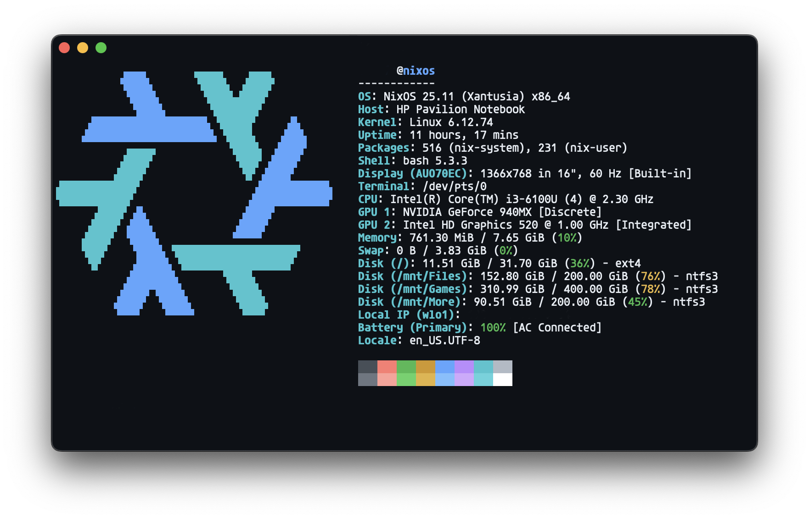

# 🏠 NixOS Homelab

A fully declarative, reproducible NixOS server configuration for self-hosted services, managed with Nix Flakes.

 


---

## Table of Contents

- [Overview](#overview)
- [Repository Structure](#repository-structure)
- [Flake Inputs (Dependencies)](#flake-inputs-dependencies)
- [System Overview](#system-overview)
- [Hardware](#hardware)
- [Native Services](#native-services)
- [Docker Services](#docker-services)
- [Networking & Security](#networking--security)
- [Automation & Maintenance](#automation--maintenance)
- [Shell Aliases](#shell-aliases)
- [Quick Start](#quick-start)
  - [Prerequisites](#prerequisites)
  - [1. Clone the repository](#1-clone-the-repository)
  - [2. Replace the hardware configuration](#2-replace-the-hardware-configuration)
  - [3. Review and customize](#3-review-and-customize)
  - [4. Apply the configuration](#4-apply-the-configuration)
  - [5. Verify services](#5-verify-services)
- [Adding a New Module](#adding-a-new-module)
- [To-do](#to-do)
- [Contributing](#contributing)
- [License](#license)

---

## Overview

This repository hosts the complete NixOS configuration for a home server running several self-hosted services via Docker. The entire system is defined declaratively using **Nix Flakes**, making it fully reproducible and easy to roll back.

**Key highlights:**
- Declarative infrastructure, so no manual configuration drift
- Modular layout separating core, services, security, and hardware
- Automated weekly upgrades and garbage collection
- Hardened SSH with key-only authentication
- Accessible from anywhere via tailscale




---

## Repository Structure

```bash
nixos-homelab/
.
├── configuration.nix
├── flake.lock
├── flake.nix
├── hardware-configuration.nix
├── LICENSE
├── modules
│   ├── core
│   │   ├── network.nix
│   │   ├── packages
│   │   │   ├── system-pkgs.nix
│   │   │   └── user-pkgs.nix
│   │   ├── system.nix
│   │   └── users.nix
│   ├── hardware
│   │   └── storage.nix
│   ├── security
│   │   ├── fail2ban.nix
│   │   ├── firewall.nix
│   │   └── ssh.nix
│   └── services
│       ├── caddy.nix
│       ├── docker-containers.nix
│       ├── gotify.nix
│       ├── minecraft.nix
│       ├── monitoring.nix
│       └── navidrome.nix
├── README.md
└── setup.sh
```

---

## Flake Inputs (Dependencies)

Defined in [`flake.nix`](./flake.nix):

| Input | Source | Purpose |
|---|---|---|
| `nixpkgs` | `NixOS/nixpkgs/nixos-25.11` | Core NixOS packages & modules |
| `nixos-hardware` | `NixOS/nixos-hardware` | Hardware-specific modules (Intel CPU) |
| `flake-utils` | `numtide/flake-utils` | Flake helper utilities |
| `agenix` | `ryantm/agenix` | Secret management |

---

## System Overview

| Property | Value |
|---|---|
| **Hostname** | `nixos` |
| **Primary User** | `tanvir` |
| **Architecture** | `x86_64-linux` |
| **NixOS Version** | `25.11` |
| **Timezone** | `Asia/Dhaka` |
| **Bootloader** | GRUB on `/dev/sda` |
| **CPU** | Intel (microcode + auto-cpufreq) |
| **Filesystem** | ext4 root + NTFS FUSE mount at `/mnt/Files`, `/mnt/Games` & `/mnt/More` |

---

## Hardware

This configuration runs on a repurposed laptop serving as a 24/7 home server.

| Component | Details |
|---|---|
| **Machine** | HP Pavilion 15-au016tx |
| **CPU** | Intel Core i3-6100U (6th Gen Skylake, 2C/4T, 2.3 GHz, 3MB Cache) |
| **iGPU** | Intel HD Graphics 520 |
| **dGPU** | NVIDIA GeForce 940MX (2GB DDR3 VRAM) |
| **RAM** | 8GB DDR4 2133MHz (max supported: 16GB) |
| **Storage** | 1TB HDD (5400rpm SATA) |
| **Wireless** | 802.11 b/g/n/ac + Bluetooth 4.0 |

> **Note:** The laptop lid is configured to be ignored so the machine stays on while closed (see `modules/core/system.nix`).

---

## Native Services

| Service | Port(s) | Description |
|---|---|---|
| [Navidrome](https://www.navidrome.org/) | `4533` | Music streaming server (Subsonic-compatible) |
| [Grafana](https://grafana.com/) | `3000` | The open-source platform for monitoring and observability |
| [Prometheus](https://prometheus.io/) | `9090` | The open-source monitoring and alerting toolkit |
| [Minecraft (PaperMC)](https://papermc.io/) | `46565` | Minecraft game server |

## Docker Services

| Service | Port(s) | Description |
|---|---|---|
| [slskd](https://github.com/slskd/slskd) | `5030` / `50300` | Soulseek web client |
| [qBittorrent](https://www.qbittorrent.org/) | `8080` | BitTorrent client with Web UI |
| [Metadata-remote](https://github.com/wow-signal-dev/metadata-remote) | `8338` | Music metadata management |
| [Focalboard](https://www.focalboard.com/) | `8000` | Notion-like project management board |
| [Microbin](https://microbin.eu/) | `8081` | Pastebin alternative

---

## Networking & Security

- **Tailscale** enabled with firewall support for the `tailscale0` interface
- **Firewall:** 
  - Open TCP ports: `80`, `443`, `2222` (SSH), `4533` (Navidrome), `5030` (slskd), `8080` (qBittorrent), `8081` (microbin) and `46565` (Minecraft)
  - Open UDP ports: `50300` (slskd-transfer), and `41641` (tailscale)
- **SSH:** Port `2222`, password auth disabled, public key only, root login prohibited
- **Fail2ban:** Active intrusion prevention

---

## Automation & Maintenance

| Feature | Schedule / Detail |
|---|---|
| **System Upgrades** | Weekly, Fridays at 04:00 (no auto-reboot) |
| **Garbage Collection** | Weekly, removes generations older than 7 days |
| **Store Optimization** | Automatic Nix store deduplication |
| **Memory** | Zram swap enabled |
| **Power** | Laptop lid ignored; stays awake on external power |

---

## Shell Aliases

| Alias | Command | Description |
|---|---|---|
| `nix-switch` | `sudo nixos-rebuild switch --flake /etc/nixos#nixos` | Rebuild & apply configuration |
| `nix-clean` | `sudo nix-collect-garbage -d` | Full Nix store cleanup |
| `neofetch` | `clear ; fastfetch` | Fetch system info |

---

## Quick Start

### Prerequisites

- A bare-metal or VM machine running [NixOS](https://nixos.org/download/)
- Nix Flakes enabled
- Git installed

### 1. Clone the repository

```bash
git clone https://github.com/Tanvir101cmd/nixos-homelab.git
cd nixos-homelab
```

### 2. Replace the hardware configuration

**DO NOT USE THE GIVEN `hardware-configuration.nix`** 

Instead, generate your own and replace the existing one:

```bash
sudo nixos-generate-config --show-hardware-config > hardware-configuration.nix
```

### 3. Review and customize

Update the following files to match your system:

- `modules/core/users.nix` - set your username and SSH public key
- `modules/core/system.nix` - set your hostname, timezone, locale, bootloader
- `modules/hardware/storage.nix` - update UUIDs and mount paths
- `modules/services/docker-containers.nix` - adjust service ports and volume paths

### 4. Apply the configuration

```bash
sudo nixos-rebuild switch --flake .#nixos
```

Or use the built-in alias after the first apply:

```bash
nix-switch
```

### 5. Verify services

```bash
docker ps          # Check running containers
systemctl status   # Check systemd service health
```

---

## Adding a New Module

1. Create a new `.nix` file under the appropriate `modules/` subdirectory.
2. Add your module to the `modules` list in `flake.nix`.
3. Rebuild with `nix-switch`.

Example skeleton for a new service:

```nix
# modules/services/my-service.nix
{ config, pkgs, ... }:
{
  virtualisation.oci-containers.containers.my-service = {
    image = "my-image:latest";
    ports = [ "9000:9000" ];
    volumes = [ "/mnt/Files/MyService:/data" ];
  };
}
```

---

## To-do
- [x] Implementing monitoring tools
- [x] Better CI implementation
- [ ] Actual CD implementation
- [ ] Email or discord notification to show which services are hanging and crashed
- [ ] Encrypting ssh keys and lastfm api keys via agenix
- [ ] Use of home manager to be able to reproduce user's home directory

---

## Contributing

Contributions, suggestions, and improvements are welcome!

1. **Fork** this repository
2. **Create** a feature branch: `git checkout -b feat/my-improvement`
3. **Commit** your changes: `git commit -m "feat: add my improvement"`
4. **Push** to your branch: `git push origin feat/my-improvement`
5. **Open a Pull Request** against `main`

Please keep changes modular - one logical change per PR. If you're adding a new service, place it in `modules/services/` and register it in `flake.nix`.

---

## License

This project is licensed under the **MIT License** - see the [LICENSE](./LICENSE) file for details.

Copyright (c) 2026 [@Tanvir101cmd](https://github.com/Tanvir101cmd)
